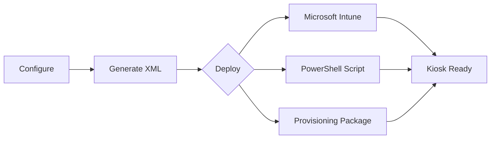
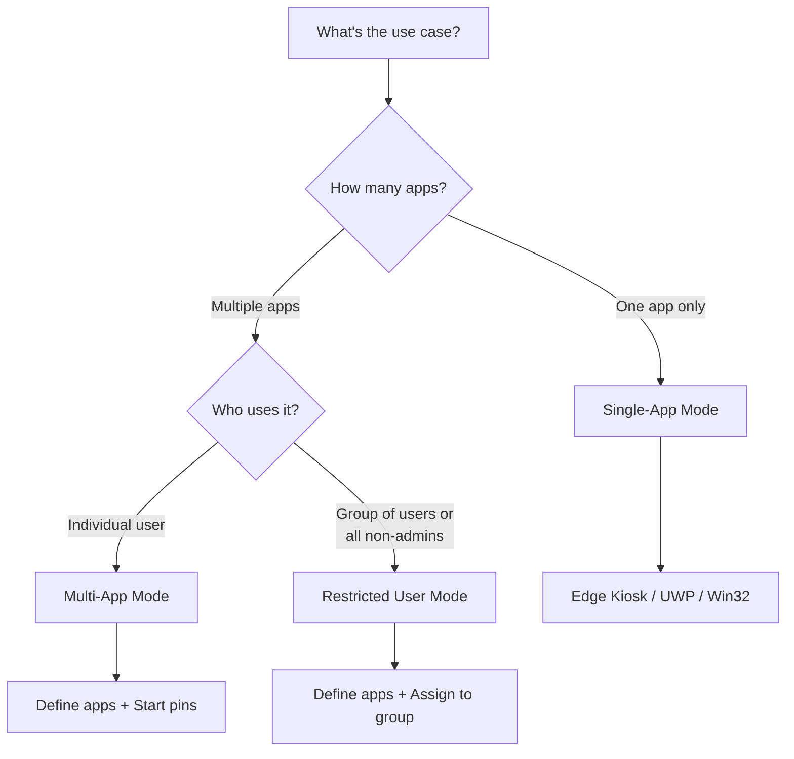

# AssignedAccess XML Builder

A visual tool for creating Windows 11 kiosk configurations—no XML expertise required.

**Hosted app:** https://aaxb.pages.dev

## Executive Summary

| Challenge | Solution |
|-----------|----------|
| Manual XML authoring is error-prone and time-consuming | Point-and-click interface generates valid XML instantly |
| Inconsistent kiosk configurations across devices | Standardized templates ensure uniform deployments |
| Debugging malformed XML wastes engineering hours | Built-in validation catches errors before deployment |

**Result**: Reduce kiosk configuration time from hours to minutes while eliminating deployment failures caused by XML syntax errors.

---

## How It Works



1. **Configure** — Select kiosk mode, apps, and account settings
2. **Generate** — XML is created in real-time with validation
3. **Deploy** — Export to Intune, PowerShell, or PPKG

---

## Choosing a Kiosk Mode



| Mode | Best For | Account Types | Example |
|------|----------|---------------|---------|
| **Single-App** | Signage, check-in terminals | Auto Logon, Existing User | Lobby display showing company website |
| **Multi-App** | Shared workstations, frontline workers | Auto Logon, Existing User | Reception desk with Edge, Teams, Outlook |
| **Restricted User** | Classrooms, shared labs, group policies | User Groups, Global Profile | Student computers with limited apps |

---

## Features

### Kiosk Modes
- **Single-App** — Run one app fullscreen (Edge, UWP, or Win32)
- **Multi-App** — Allow multiple apps with custom Start menu
- **Restricted User** — Multi-app with group-based assignment

### Applications
- Microsoft Edge kiosk (web URLs or local HTML files)
- UWP/Store apps and Win32 desktop applications
- 50+ app presets (browsers, Office, utilities)
- Edge idle timeout for public kiosks

### Start Menu & Taskbar
- Start menu pin management with 27+ shortcut presets
- Taskbar show/hide control
- File Explorer restrictions (downloads, removable drives, or full access)

### Account Options
- Auto-logon (managed local account)
- Existing user (local, domain, or Azure AD)
- User groups (Local, AD, or Azure AD groups) — Restricted mode
- Global profile (all non-admin users) — Restricted mode

### Security & Access
- Breakout sequence for technician access (Ctrl+Alt+K)
- Auto-launch app configuration

### Export & Deploy
- Real-time XML validation with contextual tooltips
- PowerShell deploy script with JSON logging
- Shortcut-only script for Start Menu pins (Intune/OMA-URI scenarios)
- Start layout XML download for Intune file uploads
- Import/export XML configurations
- Tabbed deployment guide (Intune, PowerShell, PPKG)

Note: Intune’s Settings Catalog kiosk allow-list is AUMID-based only. Use OMA-URI AssignedAccess CSP when you need Win32 apps like `osk.exe` or `sndvol.exe`.

Note: If Windows blocks a downloaded script, right-click the `.ps1` file, choose **Properties**, then **Unblock**.

### Accessibility
- Dark/light theme
- WCAG accessible
- Keyboard navigation

---

## Getting Started

**Option 1: Use the Hosted Tool (Recommended)**

Open `https://aaxb.pages.dev` in any modern browser.
Use the left sidebar to navigate between Setup, Application, Start Menu, System, and Summary.

**Option 2: Run Locally**

Because the app loads presets with `fetch()`, serve the repo from a local web server:
```
1. Download or clone repository
2. Run: python -m http.server
3. Open http://localhost:8000
4. Configure and export
```

**Option 3: Host Internally** — Deploy to any web server. No backend required.

---

## Requirements

| Component | Requirement |
|-----------|-------------|
| Target OS | Windows 11 22H2+ (Windows 10 with limited features) |
| Edition | Pro, Enterprise, or Education |
| Browser | Any modern browser (Chrome, Edge, Firefox) |
| Deployment | Intune, PPKG, or PowerShell with SYSTEM privileges |

---

## Documentation

See [REFERENCE.md](REFERENCE.md) for detailed deployment instructions, troubleshooting, and technical reference.

---

## Contributing

Contributions welcome. Submit issues or pull requests on GitHub.

## Credits

Created by [Joshua Walderbach](https://www.linkedin.com/in/joshua-walderbach/)

Inspired by [Brandon Villines](https://www.linkedin.com/in/brandon-villines/)

## License

MIT License — free to use, modify, and distribute.
