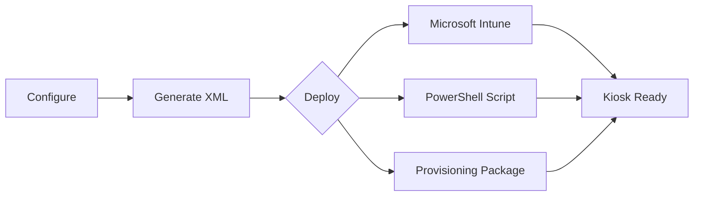
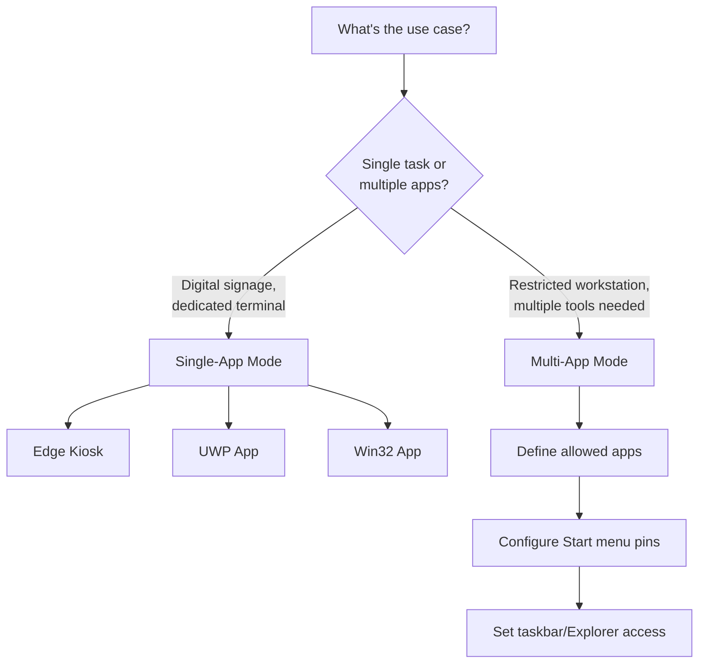
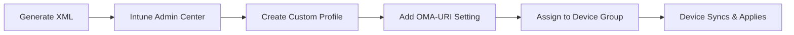

# AssignedAccess XML Builder

A visual tool for creating Windows 11 kiosk configurations—no XML expertise required.

## Executive Summary

| Challenge | Solution |
|-----------|----------|
| Manual XML authoring is error-prone and time-consuming | Point-and-click interface generates valid XML instantly |
| Inconsistent kiosk configurations across devices | Standardized templates ensure uniform deployments |
| Debugging malformed XML wastes engineering hours | Built-in validation catches errors before deployment |

**Result**: Reduce kiosk configuration time from hours to minutes while eliminating deployment failures caused by XML syntax errors.

---

## How It Works



1. **Configure** — Select kiosk mode, apps, and account settings via the web interface
2. **Generate** — XML is created in real-time with syntax highlighting and validation
3. **Deploy** — Export to your preferred deployment method

---

## Choosing a Kiosk Mode



| Mode | Best For | Example |
|------|----------|---------|
| **Single-App** | Signage, check-in terminals, single-purpose devices | Lobby display showing company website |
| **Multi-App** | Shared workstations, lab computers, frontline workers | Reception desk with Edge, Teams, and Outlook |

---

## Features

### Kiosk Modes

- **Single-App** — Lock device to one application (Edge, UWP, or Win32)
- **Multi-App** — Allow multiple applications with custom Start menu

### Application Support

- Microsoft Edge kiosk (fullscreen or public browsing)
  - Web URLs or local HTML files
  - Automatic space encoding for file paths
- UWP/Store apps via AUMID
- Win32 desktop applications
- 50+ presets (browsers, Office, system utilities)

### Account Options

- Auto-logon with managed local account
- Existing account (local, domain, or Azure AD)

### Export Options

- Copy XML to clipboard
- Download XML file
- Generate PowerShell deployment script

### Quality of Life

- Import existing XML configurations for editing
- Real-time preview with syntax highlighting
- Built-in validation
- Dark/light theme
- WCAG accessibility compliant

---

## Getting Started

### Option 1: Run Locally
```
1. Download or clone repository
2. Open index.html in any browser
3. Configure and export
```

### Option 2: Host Internally

Deploy to any web server for team access. No backend required—entirely client-side.

---

## Usage Examples

### Single-App Kiosk (Edge)

1. Select **Single-App** mode
2. Choose **Microsoft Edge (Kiosk Mode)**
3. Select source type:
   - **Web URL** — Enter a website address (e.g., `https://example.com`)
   - **Local File** — Enter a file path (e.g., `C:/Kiosk/index.html`). Spaces are encoded automatically.
4. Select kiosk type:
   - **Fullscreen** — No browser UI (digital signage)
   - **Public Browsing** — Address bar and navigation visible
5. Enable **InPrivate Mode** for public kiosks
6. Optionally enable **Breakout Sequence** for technician access (Ctrl+Alt+K)
7. Configure account (Auto Logon recommended)
8. Export

### Multi-App Kiosk

1. Select **Multi-App** mode
2. Add allowed applications (use presets or manual entry)
3. Add Start menu pins
4. Configure taskbar visibility and File Explorer access
5. Export

---

## Deployment

### Microsoft Intune (Recommended)



**OMA-URI Setting:**
| Field | Value |
|-------|-------|
| Name | AssignedAccess Configuration |
| OMA-URI | `./Device/Vendor/MSFT/AssignedAccess/Configuration` |
| Data type | String (XML) |
| Value | *Paste generated XML* |

### PowerShell Script

1. Click **Download PS1**
2. Run as SYSTEM on target device:
   ```powershell
   psexec.exe -i -s powershell.exe -ExecutionPolicy Bypass -File "Apply-AssignedAccess.ps1"
   ```
3. Reboot

### Provisioning Package (PPKG)

1. Generate XML
2. In Windows Configuration Designer:
   - Create provisioning package
   - Navigate to **Runtime Settings > AssignedAccess > AssignedAccessSettings**
   - Paste XML
3. Build and apply package

---

## Troubleshooting

| Symptom | Cause | Solution |
|---------|-------|----------|
| "Operation cancelled due to restrictions" | Win32 app blocked by RestrictRun registry | Use Edge kiosk mode or ensure all required executables are allowed |
| Kiosk not applying after reboot | Invalid XML or insufficient privileges | Validate XML in tool; ensure script ran as SYSTEM |
| Configuration partially applied | XML namespace mismatch | Regenerate XML; check Windows version compatibility |

**Diagnostic logs:** `Event Viewer > Applications and Services Logs > Microsoft > Windows > AssignedAccess`

**Remove configuration:** `Clear-AssignedAccess` cmdlet or unassign Intune profile

---

## Technical Reference

### XML Namespaces

| Namespace | Windows Version | Features Added |
|-----------|-----------------|----------------|
| `2017/config` | Base | Core kiosk functionality |
| `201901/config` (rs5) | 1903+ | DisplayName for auto-logon |
| `2021/config` (v4) | 21H2+ | ClassicAppPath, BreakoutSequence |
| `2022/config` (v5) | 22H2+ | StartPins (Windows 11) |

### Common AUMIDs

| Application | AUMID |
|-------------|-------|
| Calculator | `Microsoft.WindowsCalculator_8wekyb3d8bbwe!App` |
| Photos | `Microsoft.Windows.Photos_8wekyb3d8bbwe!App` |
| Settings | `windows.immersivecontrolpanel_cw5n1h2txyewy!microsoft.windows.immersivecontrolpanel` |
| Edge | `Microsoft.MicrosoftEdge.Stable_8wekyb3d8bbwe!App` |
| Windows Terminal | `Microsoft.WindowsTerminal_8wekyb3d8bbwe!App` |

**Find any app's AUMID:**
```powershell
Get-StartApps | Format-Table Name, AppID
```

---

## Requirements

| Component | Requirement |
|-----------|-------------|
| Target OS | Windows 11 22H2+ (Windows 10 with limited features) |
| Browser | Any modern browser (Chrome, Edge, Firefox) |
| Deployment | Intune, PPKG, or PowerShell with SYSTEM privileges |

---

## Contributing

Contributions welcome. Submit issues or pull requests on GitHub.

## Credits

Created by [Joshua Walderbach](https://www.linkedin.com/in/joshua-walderbach/)

Inspired by [Brandon Villines](https://www.linkedin.com/in/brandon-villines/)

## License

MIT License — free to use, modify, and distribute.

## Resources

- [AssignedAccess CSP Reference](https://docs.microsoft.com/en-us/windows/client-management/mdm/assignedaccess-csp)
- [Set Up a Kiosk on Windows 11](https://docs.microsoft.com/en-us/windows/configuration/kiosk-methods)
- [Configure Microsoft Edge Kiosk Mode](https://docs.microsoft.com/en-us/deployedge/microsoft-edge-configure-kiosk-mode)
