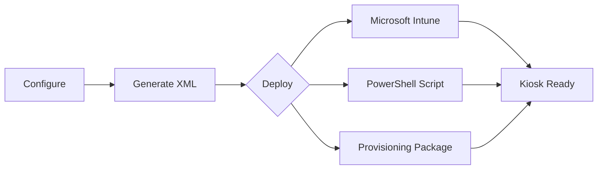

# AssignedAccess XML Builder

A visual tool for creating Windows 11 kiosk configurations—no XML expertise required.

## Executive Summary

| Challenge | Solution |
|-----------|----------|
| Manual XML authoring is error-prone and time-consuming | Point-and-click interface generates valid XML instantly |
| Inconsistent kiosk configurations across devices | Standardized templates ensure uniform deployments |
| Debugging malformed XML wastes engineering hours | Built-in validation catches errors before deployment |

**Result**: Reduce kiosk configuration time from hours to minutes while eliminating deployment failures caused by XML syntax errors.

---

## How It Works



1. **Configure** — Select kiosk mode, apps, and account settings
2. **Generate** — XML is created in real-time with validation
3. **Deploy** — Export to Intune, PowerShell, or PPKG

---

## Choosing a Kiosk Mode

```mermaid
flowchart TD
    A[What's the use case?] --> B{Single task or<br/>multiple apps?}
    B -->|Digital signage,<br/>dedicated terminal| C[Single-App Mode]
    B -->|Restricted workstation,<br/>multiple tools needed| D[Multi-App Mode]
    C --> E[Edge Kiosk]
    C --> F[UWP App]
    C --> G[Win32 App]
    D --> H[Define allowed apps]
    H --> I[Configure Start menu pins]
    I --> J[Set taskbar/Explorer access]
```



| Mode | Best For | Example |
|------|----------|---------|
| **Single-App** | Signage, check-in terminals, single-purpose devices | Lobby display showing company website |
| **Multi-App** | Shared workstations, lab computers, frontline workers | Reception desk with Edge, Teams, and Outlook |

---

## Features

- **Single-App** or **Multi-App** kiosk modes
- Microsoft Edge kiosk (web URLs or local HTML files)
- UWP/Store apps and Win32 desktop applications
- 50+ app presets (browsers, Office, utilities)
- Auto-logon or existing account support
- Import/export XML configurations
- PowerShell deploy script with JSON logging
- Dark/light theme, WCAG accessible

---

## Getting Started

**Option 1: Run Locally**
```
1. Download or clone repository
2. Open index.html in any browser
3. Configure and export
```

**Option 2: Host Internally** — Deploy to any web server. No backend required.

---

## Requirements

| Component | Requirement |
|-----------|-------------|
| Target OS | Windows 11 22H2+ (Windows 10 with limited features) |
| Browser | Any modern browser (Chrome, Edge, Firefox) |
| Deployment | Intune, PPKG, or PowerShell with SYSTEM privileges |

---

## Documentation

See [REFERENCE.md](REFERENCE.md) for detailed deployment instructions, troubleshooting, and technical reference.

---

## Contributing

Contributions welcome. Submit issues or pull requests on GitHub.

## Credits

Created by [Joshua Walderbach](https://www.linkedin.com/in/joshua-walderbach/)

Inspired by [Brandon Villines](https://www.linkedin.com/in/brandon-villines/)

## License

MIT License — free to use, modify, and distribute.
