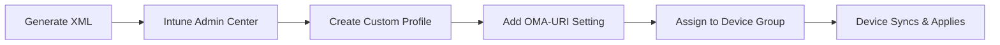

# Technical Reference

Detailed documentation for AssignedAccess XML Builder.

---

## Usage Examples

### Single-App Kiosk (Edge)

1. Select **Single-App** mode
2. Choose **Microsoft Edge (Kiosk Mode)**
3. Select source type:
   - **Web URL** — Enter a website address (e.g., `https://example.com`)
   - **Local File** — Enter a file path (e.g., `C:/Kiosk/index.html`). Spaces are encoded automatically.
4. Select kiosk type:
   - **Fullscreen** — No browser UI (digital signage)
   - **Public Browsing** — Address bar and navigation visible
5. Enable **InPrivate Mode** for public kiosks
6. Optionally enable **Breakout Sequence** for technician access (Ctrl+Alt+K)
7. Configure account (Auto Logon recommended)
8. Export

### Multi-App Kiosk

1. Select **Multi-App** mode
2. Add allowed applications:
   - Use quick-add buttons for 50+ common apps (browsers, Office, utilities)
   - Manual entry: Path (.exe) for Win32 apps, AUMID for UWP apps
3. Configure auto-launch (optional):
   - Select an app to launch automatically at sign-in
   - If Edge is selected, configure URL and kiosk type
4. Add Start menu pins:
   - Use preset shortcuts (30+ available) or create custom pins
   - Each pin needs: Name, Target path, optional arguments/icon
5. Configure system restrictions:
   - **Taskbar**: Show or hide
   - **File Explorer**: None, Downloads only, Removable drives, or Full access
6. Export

---

## Deployment

### Microsoft Intune (Recommended)



**OMA-URI Setting:**
| Field | Value |
|-------|-------|
| Name | AssignedAccess Configuration |
| OMA-URI | `./Device/Vendor/MSFT/AssignedAccess/Configuration` |
| Data type | String (XML) |
| Value | *Paste generated XML* |

### PowerShell Script

1. Click **Download Deploy Script**
2. Run as SYSTEM on target device:
   ```powershell
   psexec.exe -i -s powershell.exe -ExecutionPolicy Bypass -File "Apply-AssignedAccess.ps1"
   ```
3. The script performs:
   - Pre-flight checks (Windows edition, SYSTEM context, WMI availability)
   - Creates shortcuts in `C:\ProgramData\KioskShortcuts\` for Start menu pins
   - Applies configuration via WMI (`MDM_AssignedAccess`)
   - Generates JSON log file with timestamps and execution details
4. Reboot

### Provisioning Package (PPKG)

1. Generate XML
2. In Windows Configuration Designer:
   - Create provisioning package
   - Navigate to **Runtime Settings > AssignedAccess > AssignedAccessSettings**
   - Paste XML
3. Build and apply package

---

## Troubleshooting

| Symptom | Cause | Solution |
|---------|-------|----------|
| "Operation cancelled due to restrictions" | Win32 app blocked by RestrictRun registry | Use Edge kiosk mode or ensure all required executables are allowed |
| Kiosk not applying after reboot | Invalid XML or insufficient privileges | Validate XML in tool; ensure script ran as SYSTEM |
| Configuration partially applied | XML namespace mismatch | Regenerate XML; check Windows version compatibility |
| Start menu pins not appearing | Shortcut file missing or invalid path | Verify shortcuts exist at paths in StartPins JSON; use PowerShell script to auto-create |
| Edge not launching in kiosk mode | Missing Edge components in allowed apps | Add Edge via preset button (includes msedge.exe, proxy, and AUMID) |
| Auto-launch app not starting | App not in AllowedApps list | Ensure the auto-launch app is also added to the allowed applications list |

**Diagnostic logs:** `Event Viewer > Applications and Services Logs > Microsoft > Windows > AssignedAccess`

**Remove configuration:** `Clear-AssignedAccess` cmdlet or unassign Intune profile

---

## XML Namespaces

| Namespace | Windows Version | Features Added |
|-----------|-----------------|----------------|
| `2017/config` | Base | Core kiosk functionality |
| `201901/config` (rs5) | 1903+ | DisplayName for auto-logon, AutoLaunch |
| `2020/config` (v3) | 20H2+ | AllowRemovableDrives |
| `2021/config` (v4) | 21H2+ | ClassicAppPath, BreakoutSequence |
| `2022/config` (v5) | 22H2+ | StartPins (Windows 11) |

---

## Common AUMIDs

| Application | AUMID |
|-------------|-------|
| Calculator | `Microsoft.WindowsCalculator_8wekyb3d8bbwe!App` |
| Photos | `Microsoft.Windows.Photos_8wekyb3d8bbwe!App` |
| Settings | `windows.immersivecontrolpanel_cw5n1h2txyewy!microsoft.windows.immersivecontrolpanel` |
| Edge | `Microsoft.MicrosoftEdge.Stable_8wekyb3d8bbwe!App` |
| Windows Terminal | `Microsoft.WindowsTerminal_8wekyb3d8bbwe!App` |
| Snipping Tool | `Microsoft.ScreenSketch_8wekyb3d8bbwe!App` |
| Sticky Notes | `Microsoft.MicrosoftStickyNotes_8wekyb3d8bbwe!App` |
| Paint | `Microsoft.Paint_8wekyb3d8bbwe!App` |
| Camera | `Microsoft.WindowsCamera_8wekyb3d8bbwe!App` |
| Movies & TV | `Microsoft.ZuneVideo_8wekyb3d8bbwe!App` |

**Find any app's AUMID:**
```powershell
Get-StartApps | Format-Table Name, AppID
```

---

## Common Executable Paths

| Application | Path |
|-------------|------|
| Edge | `C:\Program Files (x86)\Microsoft\Edge\Application\msedge.exe` |
| Chrome | `C:\Program Files\Google\Chrome\Application\chrome.exe` |
| Firefox | `C:\Program Files\Mozilla Firefox\firefox.exe` |
| Notepad | `C:\Windows\System32\notepad.exe` |
| On-Screen Keyboard | `C:\Windows\System32\osk.exe` |
| Command Prompt | `C:\Windows\System32\cmd.exe` |
| PowerShell | `C:\Windows\System32\WindowsPowerShell\v1.0\powershell.exe` |
| File Explorer | `C:\Windows\explorer.exe` |
| Control Panel | `C:\Windows\System32\control.exe` |

---

## Resources

- [AssignedAccess CSP Reference](https://docs.microsoft.com/en-us/windows/client-management/mdm/assignedaccess-csp)
- [Set Up a Kiosk on Windows 11](https://docs.microsoft.com/en-us/windows/configuration/kiosk-methods)
- [Configure Microsoft Edge Kiosk Mode](https://docs.microsoft.com/en-us/deployedge/microsoft-edge-configure-kiosk-mode)
